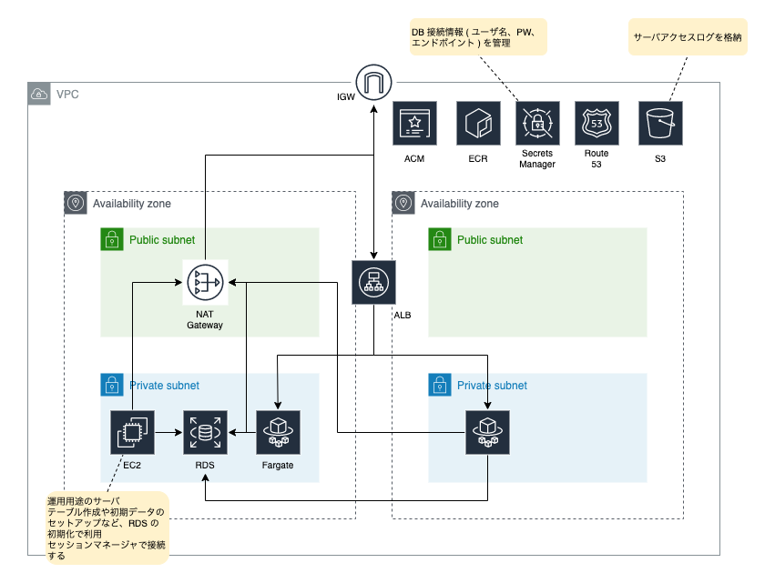

# AWS

Terraform の構成、AWS に構築するシステム構成図、構築手順を説明する。

## バージョン

- Terraform 1.3.2
- Docker 20.10.12 ( build e91ed57 )

## 構成

コードの可読性を重視して、環境 ( 開発、評価、検証、本番 ) ごとにディレクトリを分ける構成とした。

各ディレクトリは network、database、applicatiion、operation、monitoring、shared ディレクトリで構成される。各ディレクトリの内容は以下の通り。

### network

構築する AWS リソースの内、ALB や NAT Gateway などネットワーク関連のリソースを構築する Terraform を格納したディレクトリ。

### database

構築する AWS リソースの内、RDS などデータベース関連のリソースを構築する Terraform を格納したディレクトリ。

### application

構築する AWS リソースの内、ECS などアプリケーション関連のリソースを構築する Terraform を格納したディレクトリ。

### operation

構築する AWS リソースの内、EC2 や SSM など運用関連のリソースを構築する Terraform を格納したディレクトリ。

### monitoring

構築する AWS リソースの内、EventBridge など監視関連のリソースを構築する Terraform を格納したディレクトリ。

### shared

各ディレクトリで共通して利用する設定を記述したファイルを格納したディレクトリ。

## システム構成図



## 環境構築手順

開発環境を例に構築する手順・コマンドを記載する。コマンド実行時に指定する `YOUR_AWS_ACCESS_KEY_ID` と `YOUR_AWS_SECRET_ACCESS_KEY` は適宜読み替えること。

### 事前準備

- ドメインを取得済みであること
- Route 53 に取得したドメインのホストゾーンを作成済みであること
- サーバ証明書を発行し ACM にインポート済みであること
- ECR リポジトリ ( `railway_pricing` ) を作成済であること
- `railway_pricing` にコンテナイメージを push 済みであること ( タグは `0.1.0` )

### 手順


1. 本リポジトリを clone する

   ```
   git clone https://github.com/n-ono/jr-pricing-aws.git
   ```

2. ディレクトリを移動する

   ```
   cd jr-pricing-awsinfra/aws/development
   ```

3. network ディレクトリ配下にある Terraform を apply する

   ```
   docker run \
     -e AWS_ACCESS_KEY_ID="YOUR_AWS_ACCESS_KEY_ID" \
     -e AWS_SECRET_ACCESS_KEY="YOUR_AWS_SECRET_ACCESS_KEY" \
     -e AWS_DEFAULT_REGION="ap-northeast-1" \
     -it --rm -v $PWD:/app/ -w /app/application/ \
     hashicorp/terraform:1.3.2 apply -auto-approve
   ```

   ドメインの入力を求められるので、事前準備で用意したドメインを入力して Enter を押下する

4. operation ディレクトリ配下にある Terraform を apply する

   ```
   docker run \
     -e AWS_ACCESS_KEY_ID="YOUR_AWS_ACCESS_KEY_ID" \
     -e AWS_SECRET_ACCESS_KEY="YOUR_AWS_SECRET_ACCESS_KEY" \
     -e AWS_DEFAULT_REGION="ap-northeast-1" \
     -it --rm -v $PWD:/app/ -w /app/operation/ \
     hashicorp/terraform:1.3.2 apply -auto-approve
   ```

5. database ディレクトリ配下にある Terraform を apply する

   ```
   docker run \
     -e AWS_ACCESS_KEY_ID="YOUR_AWS_ACCESS_KEY_ID" \
     -e AWS_SECRET_ACCESS_KEY="YOUR_AWS_SECRET_ACCESS_KEY" \
     -e AWS_DEFAULT_REGION="ap-northeast-1" \
     -it --rm -v $PWD:/app/ -w /app/database/ \
     hashicorp/terraform:1.3.2 apply -auto-approve
   ```

   DB 接続パスワードの入力を求められるので、入力して Enter を押下する

6. 手順 4 で構築した EC2 インスタンス ( `bastion` ) に ssh して、[初期化用 SQL](../../infra/docker/db/postgres/init/) を実行する

7. Secrets Manager に DB 接続情報を設定する

   |パラメータ名|用途|設定値|
   |--|--|--|
   |database-username|DB の接続ユーザ名|catalogue|
   |database-password|DB の接続パスワード|手順 5 で設定した値|
   |database-endpoint|DB のエンドポイント|`jdbc:postgresql://RDS_ENDPOINT:5432/catalogue_db` ( `RDS_ENDPOINT` は置き換える )|

8. application ディレクトリ配下にある Terraform を apply する

   ```
   docker run \
     -e AWS_ACCESS_KEY_ID="YOUR_AWS_ACCESS_KEY_ID" \
     -e AWS_SECRET_ACCESS_KEY="YOUR_AWS_SECRET_ACCESS_KEY" \
     -e AWS_DEFAULT_REGION="ap-northeast-1" \
     -it --rm -v $PWD:/app/ -w /app/application/ \
     hashicorp/terraform:1.3.2 apply -auto-approve
   ```

9. monitoring ディレクトリ配下にある Terraform を apply する

   ```
   docker run \
     -e AWS_ACCESS_KEY_ID="YOUR_AWS_ACCESS_KEY_ID" \
     -e AWS_SECRET_ACCESS_KEY="YOUR_AWS_SECRET_ACCESS_KEY" \
     -e AWS_DEFAULT_REGION="ap-northeast-1" \
     -it --rm -v $PWD:/app/ -w /app/monitoring/ \
     hashicorp/terraform:1.3.2 apply -auto-approve
   ```
