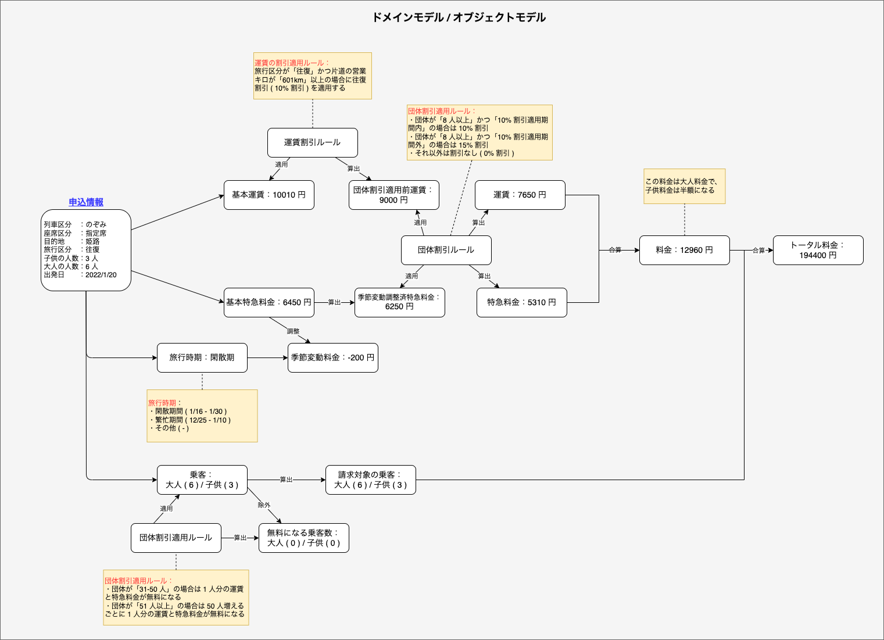

# モデル

本プロジェクトで採用したドメインモデル / オブジェクトモデルを説明する。

## ドメインモデル / オブジェクトモデル

背景が白の四角はドメインオブジェクトを、黄色の四角はドメインオブジェクトに実装する業務ロジックをそれぞれ表す。

ユーザのインプット ( 申込情報 ) から最終的なアウトプット ( トータル料金 ) は以下の流れで計算する。

1. 申込情報から基本運賃を算出する

   基本運賃は目的地から自動で決まる

2. 手順 1 で算出した基本運賃に運賃割引ルールを適用して運賃を算出する

3. 申込情報から基本特急料金を算出する

   基本特急料金は列車区分、座席区分、目的地から自動で決まる

4. 手順 3 で算出した基本特急料金に季節変動料金を調整した調整済特急料金を算出する

   季節変動料金は申込情報の出発日から自動で決まる

5. 手順 4 で算出した調整済特急料金に特急料金割引ルールを適用して特急料金を算出する

6. 乗客から団体割引適用ルールが適用される乗客数 ( 無料になる乗客数 ) を除外した請求対象の乗客を算出する

7. 手順 2, 5 で算出した運賃と特急料金を合計して 1 人あたりの料金を算出する

8. 手順 7 で算出した料金に手順 6 で算出した請求対象の乗客数を掛けてトータルの料金を算出する
